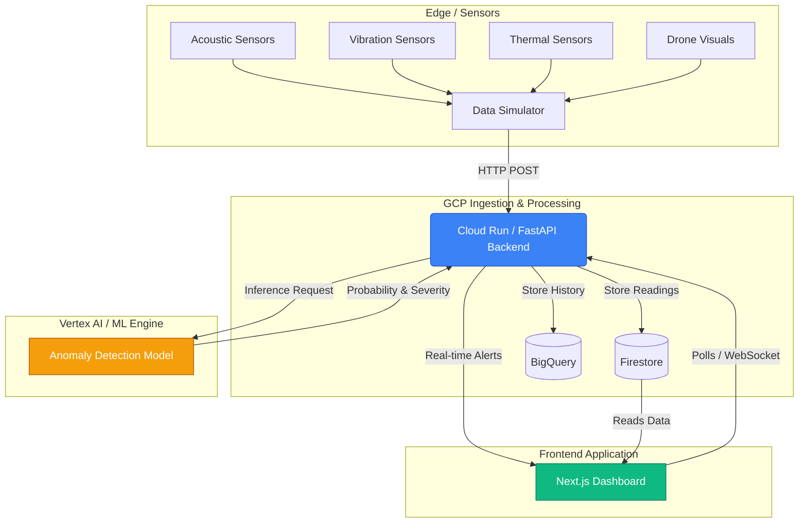

# InfraPredict AI Architecture

## High-Level System Design

## Component Details

1. **Edge/Sensors:** Simulated via a Python script (`simulator/main.py`) that generates pseudo-random multi-modal data and introduces sudden anomalous spikes.
2. **Backend API:** A FastAPI service (`backend/main.py`) that ingests data, stores it in memory (or Firestore in production), and runs ML inferences.
3. **ML Inference:** Currently an integrated mock anomaly detection heuristic acting as a stand-in for a Vertex AI deployed Isolation Forest model.
4. **Frontend:** A Next.js 14 App Router application with TailwindCSS and Recharts, offering real-time visualization of sensor telemetries, infrastructure health, and alerts via an interactive Map (`react-leaflet`).
